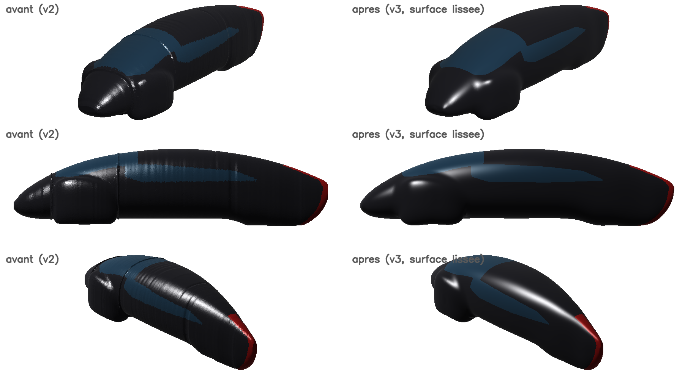
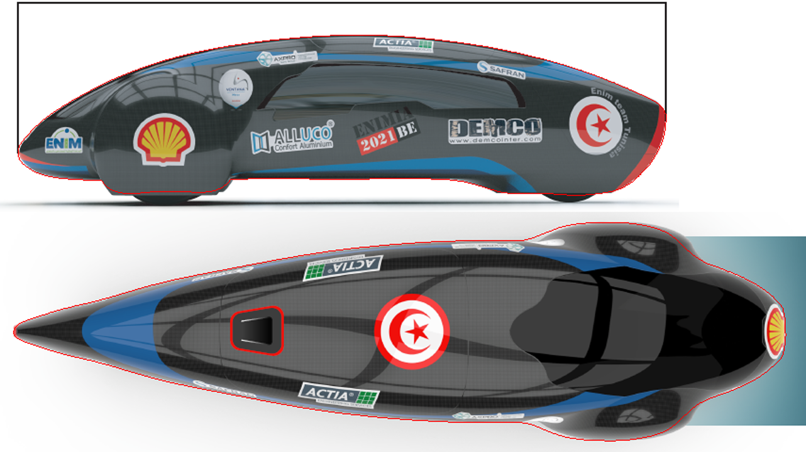

# Black ENIMIA — URDF Model


ROS 2 description package **`enimia_black_description`** for **Black ENIMIA**, the Shell Eco-marathon prototype of **ENIM Team Tunisia** (École Nationale d'Ingénieurs de Monastir).

The package contains a complete URDF of the vehicle: chassis, steered front wheels, driven rear wheel and a carbon body reconstructed from the official side and top renders. The base and all wheels are linked to the chassis and enclosed in the body.



---

## Contents

- [Vehicle specifications](#vehicle-specifications)
- [Repository structure](#repository-structure)
- [Requirements](#requirements)
- [Installation](#installation)
- [Usage](#usage)
- [Model description](#model-description)
- [How the body was built](#how-the-body-was-built)
- [Assumptions and limitations](#assumptions-and-limitations)
- [Customization](#customization)
- [Version history](#version-history)
- [Roadmap](#roadmap)
- [Team and license](#team-and-license)

---

## Vehicle specifications

| Parameter | Value | Source |
|---|---|---|
| Overall length | 2684 mm | Spec sheet |
| Overall width | 770 mm | Spec sheet |
| Overall height | 695 mm | Spec sheet |
| Wheelbase | 1704 mm | Spec sheet |
| Front track | 567 mm | Spec sheet |
| Total mass (without driver) | 25 kg | Spec sheet |
| Front overhang | 593 mm | Measured on side view |
| Rear overhang | 387 mm | Measured on side view |
| Front wheel radius | 210 mm | Estimated (limited by fairing height) |
| Rear wheel radius | 180 mm | Estimated (tyre arc visible on side view) |
| Tyre width | 35 mm | Assumed |
| Steering range | ±0.21 rad (≈ ±12°) | Chosen for a ≈ 8 m turning radius |

Layout: **tricycle** with two steered front wheels, each inside its own fairing, and one rear driven wheel with a hub motor.

---

## Repository structure

```
Black-Enimia-URDF/
├── CMakeLists.txt
├── package.xml
├── urdf/
│   └── enimia_black.urdf          # robot description
├── meshes/
│   ├── body_shell.dae             # carbon body (smooth normals)
│   ├── canopy.dae                 # windshield + side windows
│   ├── tail_tip.dae               # red trailing edge
│   ├── body_collision.stl         # simplified convex hull (collision)
│   └── stl/                       # flat-shaded STL copies of the visual meshes
│       ├── body_shell.stl
│       ├── canopy.stl
│       └── tail_tip.stl
├── launch/
│   └── display.launch.py          # robot_state_publisher + joint sliders + RViz
├── rviz/
│   └── display.rviz               # RViz configuration (fixed frame: base_footprint)
└── docs/
    ├── lissage_avant_apres.png    # surface before / after smoothing
    └── comparaison_vues.png       # model contour overlaid on the original renders
```

---

## Requirements

- **ROS 2** with `ament_cmake` and `colcon`
- `robot_state_publisher`
- `joint_state_publisher_gui`
- `rviz2`

On Windows, use **WSL2 with Ubuntu** or a Linux machine to build and run the package.

---

## Installation

```bash
mkdir -p ~/ros2_ws/src
cd ~/ros2_ws/src
git clone https://github.com/youcefhkcm-maker/Black-Enimia-URDF.git enimia_black_description

cd ~/ros2_ws
rosdep install --from-paths src --ignore-src -y
colcon build --packages-select enimia_black_description
source install/setup.bash
```

> Cloning into a folder named `enimia_black_description` is optional. ROS reads the package name from `package.xml`, so the `package://enimia_black_description/...` mesh paths work whatever the folder is called.

---

## Usage

### Visualize in RViz

```bash
ros2 launch enimia_black_description display.launch.py
```

This starts `robot_state_publisher`, `joint_state_publisher_gui` and RViz with the provided configuration. Use the sliders to steer the front wheels and spin the wheels.

### Check the URDF

```bash
check_urdf ~/ros2_ws/src/enimia_black_description/urdf/enimia_black.urdf
```

`check_urdf` is provided by `liburdfdom-tools`.

### Use the description in your own launch file

```python
import os
from ament_index_python.packages import get_package_share_directory
from launch_ros.actions import Node

pkg = get_package_share_directory('enimia_black_description')
with open(os.path.join(pkg, 'urdf', 'enimia_black.urdf')) as f:
    robot_description = f.read()

robot_state_publisher = Node(
    package='robot_state_publisher',
    executable='robot_state_publisher',
    parameters=[{'robot_description': robot_description}],
)
```

### Use outside ROS

- Mesh paths use `package://enimia_black_description/...`. Tools that don't understand this scheme need the paths replaced by relative or absolute paths.
- For tools that don't read COLLADA, such as PyBullet or MuJoCo, point the three visual `<mesh>` tags to `meshes/stl/*.stl` instead of `meshes/*.dae`.

---

## Model description

### Coordinate frames

The frames follow REP-103: **X forward, Y left, Z up**, in SI units.

| Frame | Location |
|---|---|
| `base_footprint` | On the ground, centred between the front axle and the rear axle |
| `base_link` | 0.21 m above `base_footprint`, at front axle height |
| `body_link` | Same origin as `base_footprint` (the body meshes are expressed in the ground frame) |

The nose is at x = +1.445 m and the tail at x = −1.239 m, relative to `base_footprint`.

### Kinematic tree

```
base_footprint
└── base_link                      (chassis)
    ├── body_link                  fixed      body + windows + red trailing edge
    ├── front_left_steer_link      revolute   steering
    │   └── front_left_wheel_link  continuous
    ├── front_right_steer_link     revolute   steering
    │   └── front_right_wheel_link continuous
    └── rear_wheel_link            continuous drive wheel
```

### Joints

| Joint | Type | Parent → Child | Origin (m) | Axis | Limits |
|---|---|---|---|---|---|
| `base_footprint_joint` | fixed | base_footprint → base_link | (0, 0, 0.21) | — | — |
| `body_joint` | fixed | base_link → body_link | (0, 0, −0.21) | — | — |
| `front_left_steer_joint` | revolute | base_link → front_left_steer_link | (0.852, 0.2835, 0) | Z | ±0.21 rad, 20 N·m, 2 rad/s |
| `front_right_steer_joint` | revolute | base_link → front_right_steer_link | (0.852, −0.2835, 0) | Z | ±0.21 rad, 20 N·m, 2 rad/s |
| `front_left_wheel_joint` | continuous | front_left_steer_link → front_left_wheel_link | (0, 0, 0) | Y | 10 N·m, 40 rad/s |
| `front_right_wheel_joint` | continuous | front_right_steer_link → front_right_wheel_link | (0, 0, 0) | Y | 10 N·m, 40 rad/s |
| `rear_wheel_joint` | continuous | base_link → rear_wheel_link | (−0.852, 0, −0.03) | Y | 15 N·m, 40 rad/s |

### Links and masses

| Link | Mass | Contents |
|---|---|---|
| `base_link` | 12.7 kg | Floor pan, front cross member, steering column, roll hoop, rear fork, battery |
| `body_link` | 7.0 kg | Carbon body (inertia computed as a thin shell) |
| `front_left_steer_link` / `front_right_steer_link` | 0.4 kg each | Steering knuckles |
| `front_left_wheel_link` / `front_right_wheel_link` | 1.0 kg each | Front wheels |
| `rear_wheel_link` | 2.5 kg | Rear wheel (0.9 kg) + hub motor (1.6 kg) |
| **Total** | **25.0 kg** | |

### Meshes

| File | Role | Notes |
|---|---|---|
| `meshes/body_shell.dae` | Visual | Carbon body, semi-transparent so the chassis and wheels are visible |
| `meshes/canopy.dae` | Visual | Tinted windshield and side windows |
| `meshes/tail_tip.dae` | Visual | Red trailing edge |
| `meshes/body_collision.stl` | Collision | Convex hull of the body (≈ 600 faces) |
| `meshes/stl/*.stl` | Fallback | Same visual meshes in STL, flat shading |

The DAE files embed per-vertex normals and materials, so RViz and Gazebo render a smooth surface. Colours are also defined in the URDF for tools that ignore mesh materials.

---

## How the body was built

1. **Silhouette extraction.** The outlines of the official side and top renders were extracted pixel by pixel. The scale comes from the 2684 mm dimension line (≈ 3.9 mm/px on the side view, ≈ 3.3 mm/px on the top view).
2. **Smooth profiles.** The roof line, bottom line and plan-view width were fitted with C2 B-splines (mean deviation ≈ 1 mm from the extracted silhouettes), with a rounded nose.
3. **Shape.** A fuselage with superelliptic cross-sections, plus two front wheel fairings. The fairing outline comes from the side view and its width from the top view. The fairings are blended into the fuselage with a rounded fillet.
4. **Surface.** The shape is converted to a triangle mesh on a 5 mm grid, then smoothed (Taubin smoothing) to about 110 000 triangles.
5. **Export.** Vertex normals are taken from the underlying smooth surface. The windows and red trailing edge are cut along smooth curves and exported as separate COLLADA meshes.

**Silhouette agreement** (intersection over union with the original renders): **93.3 %** on the side view and **97.4 %** on the top view.



---

## Assumptions and limitations

- **Wheel radii are estimates** taken from the images (210 mm front, 180 mm rear). Replace them with measured values when available.
- **Mass distribution is assumed.** Only the 25 kg total comes from the spec sheet.
- **The front view is a perspective render**, so it was only used for the general cross-section shape, not for measurements.
- **Livery is not modelled**: sponsor logos, decals and blue stripes are absent.
- **At full steering lock**, the outer front tyre intersects the front of its fairing by about 9 mm.
- **The body collision hull encloses the wheels.** This is fine with self-collision disabled (the Gazebo default). If you enable self-collision, exclude the body–wheel pairs.
- **The DAE meshes were validated with pycollada and trimesh**, but not yet in RViz itself. If materials or transparency look wrong, switch to the STL fallback (see [Customization](#customization)).
- **No actuation plugins yet.** The URDF includes inertias, collisions and tyre friction (`mu1`/`mu2`) but no `ros2_control` or Gazebo drive and steering plugins.

---

## Customization

### Change the wheel radius

**Front wheels** (current radius 0.21 m), in `urdf/enimia_black.urdf`:

1. Set `radius` on the tyre cylinders (visual and collision) of both front wheels. The rim visual uses `R − 0.035`.
2. Set `base_footprint_joint` origin z to `R`.
3. Set `body_joint` origin z to `−R`.
4. Set `rear_wheel_joint` origin z to `R_rear − R`.
5. Update the wheel inertias.

**Rear wheel** (current radius 0.18 m):

1. Set `radius` on the rear tyre cylinders.
2. Set `rear_wheel_joint` origin z to `R_rear − R_front`.
3. Update the inertia.

### Change masses

Edit the `<mass>` and `<inertia>` tags of each link. Keep the total consistent with the measured vehicle mass.

### Change the steering range

Edit `lower` and `upper` in the `<limit>` tag of both `*_steer_joint` joints.

### Switch to STL meshes

In the three visual `<mesh>` tags of `body_link`, replace:

```xml
package://enimia_black_description/meshes/body_shell.dae
```

with:

```xml
package://enimia_black_description/meshes/stl/body_shell.stl
```

Do the same for `canopy` and `tail_tip`. The URDF colours then apply, with flat shading.

---

## Version history

| Version | Changes |
|---|---|
| v1 | Body built from analytic profiles, wheels and chassis as primitives |
| v2 | Body fitted to the side and top views, separate wheel fairings, windows and red trailing edge, measured wheel positions |
| v3 | Smoothed outer surface: C2 profiles, rounded fairing blends, COLLADA meshes with smooth normals, clean window edges |

---

## Roadmap

- [ ] Measured wheel dimensions
- [ ] Measured masses and inertias per subassembly
- [ ] Driver and ballast model
- [ ] `ros2_control` and Gazebo plugins for steering and drive
- [ ] Body mesh exported from the team's CAD model
- [ ] Livery (logos and stripes) as textures

---

## Team and license

Developed by **ENIM Team Tunisia** — Mechanical team, Shell Eco-marathon 2026–2027.

Released under the **MIT License**, as declared in `package.xml`.
